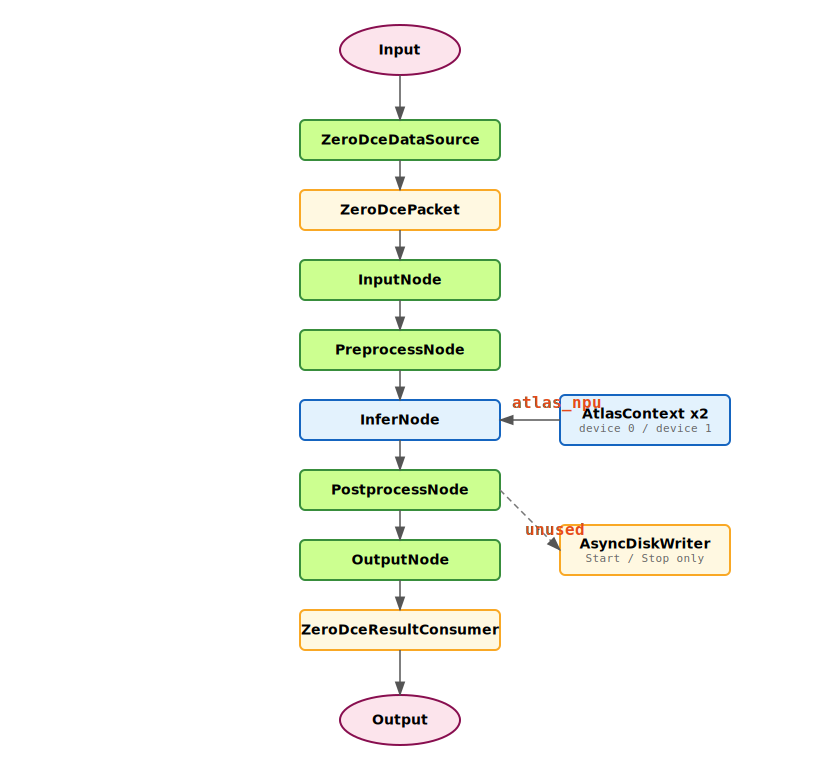

# GryFlux Framework - ZeroDCE_Atlas

## 示例说明

`ZeroDCE_Atlas` 是一个基于 GryFlux 的 Atlas NPU 异步图像处理示例，用来演示：

- 如何把图片目录输入组织成 `DataSource -> DAG -> DataConsumer`
- 如何使用 `ResourcePool` 注册 Atlas 推理资源
- 如何把预处理、推理、后处理拆成独立节点
- 如何用 ACL 推理上下文复用模型、dataset 和输入输出 buffer

这个示例当前更接近“Zero-DCE 推理流水线骨架”，而不是完整的低照度增强成品。当前代码里：

- `PostprocessNode` 仍然输出模拟的 `PSNR / Loss / Status`
- `AsyncDiskWriter` 已接入主程序生命周期，但 `PostprocessNode` 还没有调用 `Push()`
- `InferNode` 目前只把第一个输出复制到 `packet.host_output_buffer`
- 主程序固定注册 `device 0` 和 `device 1` 两个 Atlas context

因此，这个目录最适合拿来理解 GryFlux 和 Atlas ACL 资源在异步 DAG 中的组织方式。

## 流程总览

主数据流如下：

`Input -> ZeroDceDataSource -> ZeroDcePacket -> InputNode -> PreprocessNode -> InferNode -> PostprocessNode -> OutputNode -> ZeroDceResultConsumer -> Output`

其中：

- `PreprocessNode`、`PostprocessNode` 运行在 CPU
- `InferNode` 使用资源池中的 `atlas_npu`
- `atlas_npu` 当前由两个 `AtlasContext` 实例组成，分别绑定 `device 0` 和 `device 1`

示意图见：



## 快速上手

### 1) 数据包

流水线中的数据载体是 `packet/ZeroDce_Packet.h` 里的 `ZeroDcePacket`。

当前主要字段包括：

- `frame_id`：包序号
- `input_image`：原始输入图像
- `input_tensor`：预处理后的 CHW float 数据
- `host_output_buffer`：推理输出的 host 侧字节缓存
- `image_name / int8_psnr / loss / status`：后处理阶段写入的展示指标

这里已经不再把 device buffer 放在 packet 内部，而是交给 `AtlasContext` 统一管理。

### 2) 数据源

`source/ZeroDceDataSource.cpp` 会扫描输入目录中的：

- `*.jpg`
- `*.png`

随后在 `produce()` 中逐张读取图片并生成 `ZeroDcePacket`。如果某张图片读取失败，会打印错误并跳过。

### 3) 节点

当前 DAG 包含 5 个节点：

- `InputNode`
- `PreprocessNode`
- `InferNode`
- `PostprocessNode`
- `OutputNode`

其中 `InputNode` 和 `OutputNode` 是空透传节点，主要用于让图结构更清晰。

#### `PreprocessNode`

位于 `nodes/Preprocess/PreprocessNode.cpp`，当前逻辑是：

- 将输入 resize 到 `640x480`
- 从 `BGR` 转成 `RGB`
- 转为 `float32`
- 归一化到 `[0, 1]`
- 转换为 `CHW` 排布并写入 `input_tensor`

这意味着当前示例默认按 `3 x 480 x 640` 的输入布局准备模型输入。

#### `InferNode`

位于 `nodes/Infer/InferNode.cpp`，当前逻辑是：

- 从 `AtlasContext` 获取输入 buffer 大小
- 检查 `input_tensor` 字节数是否与模型输入大小一致
- 调用 `copyToDevice()`
- 调用 `executeModel()`
- 调用 `copyToHost()`
- 把第一个输出复制到 `packet.host_output_buffer`

这里不再为每个 packet 临时创建 dataset 和 device buffer，而是复用 `AtlasContext` 中预先分配好的 ACL 资源。

#### `PostprocessNode`

位于 `nodes/Postprocess/PostprocessNode.cpp`，当前还没有做真实的 Zero-DCE 图像重建。它只会写入模拟指标：

- `image_name`
- `int8_psnr`
- `loss`
- `status`

所以当前 consumer 输出的是“骨架示例指标”，而不是实际增强结果评估。

### 4) 上下文与资源池

#### `AclEnvironment`

位于 `context/acl_environment.cpp`，负责统一管理 ACL 全局生命周期：

- 首次 acquire 时调用 `aclInit()`
- 首次使用某个设备时调用 `aclrtSetDevice()`
- 最后 release 时调用 `aclrtResetDevice()` 和 `aclFinalize()`

它用引用计数方式管理设备和 ACL 环境，避免每个 context 自己手工初始化/释放。

#### `AtlasContext`

位于 `context/AtlasContext.h/.cpp`，负责封装单个 Atlas 推理资源。当前会在初始化时完成：

- 加载 OM 模型
- 创建 `model_desc`
- 为每个输入分配 device buffer 和 input dataset
- 为每个输出分配 device buffer、host buffer 和 output dataset

运行时 `InferNode` 直接调用：

- `copyToDevice()`
- `executeModel()`
- `copyToHost()`

#### `ResourcePool`

主程序把两份 context 注册为 `atlas_npu`：

```cpp
auto device0_contexts = CreateAtlasContexts(omModelPath, 0, 1);
auto device1_contexts = CreateAtlasContexts(omModelPath, 1, 1);
atlas_contexts.insert(atlas_contexts.end(),
                      device0_contexts.begin(),
                      device0_contexts.end());
atlas_contexts.insert(atlas_contexts.end(),
                      device1_contexts.begin(),
                      device1_contexts.end());

resourcePool->registerResourceType("atlas_npu", std::move(atlas_contexts));
```

这意味着当前程序默认要求 `device 0` 和 `device 1` 都可用。

### 5) DAG 构建

`ZeroDCE_Atlas.cpp` 中的图结构如下：

```cpp
auto graphTemplate = GryFlux::GraphTemplate::buildOnce(
    [](GryFlux::TemplateBuilder *builder) {
        builder->setInputNode<InputNode>("input");
        builder->addTask<PreprocessNode>("preprocess", "", {"input"});
        builder->addTask<InferNode>("inference", "atlas_npu", {"preprocess"});
        builder->addTask<PostprocessNode>("postprocess", "", {"inference"});
        builder->setOutputNode<OutputNode>("output", {"postprocess"});
    }
);
```

### 6) 异步管道

主程序当前使用：

- `kThreadPoolSize = 8`
- `kMaxActivePackets = 16`

来构造 `GryFlux::AsyncPipeline`。

运行流程是：

```cpp
AsyncDiskWriter::GetInstance().Start(outputDir);
pipeline.run();
consumer->printMetrics();
AsyncDiskWriter::GetInstance().Stop();
```

注意：

- 当前 `output_dir` 参数仍然是必填的
- 但由于 `PostprocessNode` 没有调用 `AsyncDiskWriter::Push()`，程序目前不会真正输出增强图片

## 构建与运行

### 构建

推荐在仓库根目录执行：

```bash
bash build.sh
```

构建完成后，可执行文件通常位于：

```bash
install/bin/zero_dce_app
```

构建目录下的目标文件也会生成在：

```bash
build/src/app/ZeroDCE_Atlas/zero_dce_app
```

### 运行

```bash
./install/bin/zero_dce_app <om_model_path> <input_dir> <output_dir>
```

参数说明：

- `om_model_path`：Atlas OM 模型路径
- `input_dir`：输入图片目录
- `output_dir`：输出目录参数，当前主要用于 `AsyncDiskWriter::Start()`

## 运行输出

当前运行结束后，`ZeroDceResultConsumer` 会打印：

- 实时处理进度
- 每张图的 `INT8 PSNR / Loss / Status`
- 平均 `PSNR / Loss`
- 总耗时
- 端到端 FPS

这些指标当前来自 `PostprocessNode` 的模拟值，不代表真实的 Zero-DCE 质量评估。

## Profiling 说明

项目级构建脚本仍然支持：

```bash
bash build.sh --enable_profile
```

这会打开 GryFlux 的 profiling 编译开关，并且 `ZeroDCE_Atlas.cpp` 会在运行时调用：

```cpp
pipeline.setProfilingEnabled(true);
```

但当前这个示例已经不再主动：

- 打印 profiling summary
- 导出 timeline JSON

所以即使使用 `--enable_profile` 构建，当前 `zero_dce_app` 也不会默认输出 profiling 统计信息。

## 当前限制

当前目录与代码状态需要注意这些限制：

- `PreprocessNode` 固定按 `640x480`、`RGB`、`float32`、`CHW` 组织输入
- `InferNode` 只消费第一个模型输出
- `PostprocessNode` 没有做真实增强图像解码
- `output_image` 当前未参与完整写盘链路
- `AsyncDiskWriter` 只接入了生命周期，未真正参与主输出
- 程序默认依赖两张 Atlas 设备：`device 0` 和 `device 1`

如果你要把它推进到真实 Zero-DCE 应用，一般还需要继续补：

- 与 OM 模型完全对齐的前处理
- 输出 tensor 到图像的真实后处理
- `AsyncDiskWriter::Push()` 调用点
- 单卡/多卡自适应设备配置

## 目录结构

- `ZeroDCE_Atlas.cpp`：主程序入口
- `source/ZeroDceDataSource.h/.cpp`：输入目录扫描与 packet 生成
- `packet/ZeroDce_Packet.h`：数据包定义
- `context/acl_environment.h/.cpp`：ACL 生命周期管理
- `context/AtlasContext.h/.cpp`：Atlas 推理上下文
- `nodes/Input/*`：输入节点
- `nodes/Preprocess/*`：输入预处理
- `nodes/Infer/*`：ACL 推理执行
- `nodes/Postprocess/*`：后处理骨架与模拟指标
- `nodes/Output/*`：输出节点
- `consumer/ResultConsumer/*`：结果汇总与统计
- `consumer/DiskWriter/*`：异步写盘组件
- `assets/chart.svg`：当前 DAG 结构图
- `assets/timeline_zero_dce.png`：时间线示意图资产
