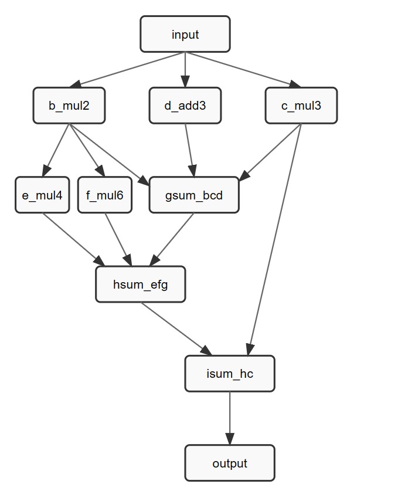

# GryFlux Framework - new_example

## 示例说明

本示例用于演示：

- 如何在 GryFlux 中构建自定义 DAG
- 如何使用资源池抽象“加法器/乘法器”等受限资源
- 如何通过模拟耗时与 profiling 观察吞吐瓶颈
- 如何通过调整上下文资源、线程池大小和最大活跃包数等来观察并行工作
- 如何在节点中注入异常，观察框架的错误处理

## DAG 结构

DAG结构图：



当前资源绑定（以代码为准）：

- `multiplier`：b_mul2、c_mul3、f_mul6
- `adder`：gsum_bcd、hsum_efg、isum_hc
- CPU（无资源）：input、d_add3、e_mul4、output

## 模拟耗时（可用于制造瓶颈）

在 [src/app/new_example/nodes/dag_nodes.h](src/app/new_example/nodes/dag_nodes.h) 的 `DagNodeDelayConfig` 中配置延时，并在节点实现里通过 `sleep_for` 模拟耗时：

- `kCpuDelayMs`
- `kAdderDelayMs`
- `kMultiplierDelayMs`

你可以通过调大 `kAdderDelayMs` 制造加法器资源瓶颈，或调大 `kMultiplierDelayMs` 制造乘法器资源瓶颈。

## Profiling 编译与运行

profiling 是“编译期开关 + 运行时启用”两段式：

1) 编译期开关：编译时定义 `GRYFLUX_BUILD_PROFILING=1`
2) 运行时启用：示例中在 `kBuildProfiling` 为 true 时调用 `pipeline.setProfilingEnabled(true)`

推荐使用脚本编译并安装（如果你刚做过文件清理/重命名，建议加 `--clean`）：

```bash
cd /workspace/gxh/GryFlux
bash ./build.sh --clean --enable_profile
```

运行：

```bash
./install/bin/new_example
```

运行结束会输出 profiling 统计，并生成 `graph_timeline.json`（用于可视化）。

## 故障注入：id 为 10 的倍数触发

为了观察框架如何处理节点执行失败：

- 在节点 `sum_bcd` 内部，当 `packet.id % 10 == 0` 时会打印错误日志并调用 `packet.markFailed()`
- 失败的 packet 会在框架内部被标记并被丢弃（consumer 不会收到它），便于把“错误路径”从“崩溃/信号”里区分出来

## 吞吐量分析：

示例会在运行结束打印两行：

- `Theoretical Max Throughput`: 一个基于“线程池 + 资源实例数 + 延时配置”的粗略上界估计
- `Throughput`: 实测吞吐

吞吐上限的计算方式：

- 资源实例数 / 每个 packet 在该资源上消耗的总时间
- 例如：`multiplier` 相关节点：b_mul2、c_mul3、f_mul6（每个 packet 需要使用 3 次 multiplier）
    - `kMultiplierDelayMs = 10ms`，`kMultiplierInstances = 2`，那么 multiplier 的吞吐上限大致是：
	**2 / 30ms ≈ 66.7 packet/s**


最终的“理论最大吞吐”通常由最紧的那个上限决定。

注意：即使资源/线程池有余量，下面这些也会把实际吞吐压下来：

- 数据源 `produce()` 的 sleep/IO（本示例里有模拟 sleep）
- consumer 的重日志打印（大量 `INFO` 会显著影响吞吐）
- 操作系统调度、CPU 频率、核数、NUMA 等环境因素

相关配置位置：

- 延时： [src/app/new_example/nodes/dag_nodes.h](src/app/new_example/nodes/dag_nodes.h)
- 并发与资源实例数： [src/app/new_example/new_example.cpp](src/app/new_example/new_example.cpp)


