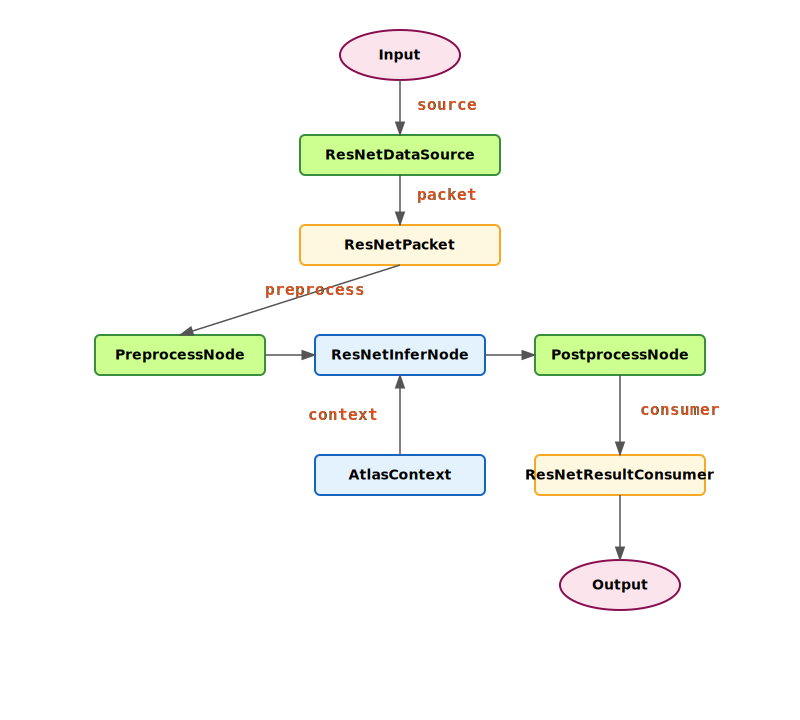

# GryFlux Framework - resnet_Atlas

## 示例说明

本示例用于演示：

- 如何在 GryFlux 中搭建基于 Atlas NPU 的图像分类异步流水线
- 如何通过 `DataSource -> DAG -> DataConsumer` 组织批量评估流程
- 如何把预处理、推理、后处理拆分为独立节点并行调度
- 如何使用 `ResourcePool` 注册双 Atlas 设备资源并自动分发推理任务
- 如何在全部样本完成后统一统计 Top-1 / Top-5 / FPS

本应用入口在 `src/app/resnet_Atlas/resnet_Atlas.cpp`，可执行文件名为 `classification_app_gryflux`。

## 快速上手

下面参照 `example/README.md` 的方式，说明当前 `resnet_Atlas` 是如何定义数据包、节点、资源上下文、DAG 和异步管道的。

### 1) 定义数据包（DataPacket）

数据包是流经整个 DAG 的载体。  
在本示例中，`ResNetPacket` 负责保存：

- 图片路径
- ground truth 标签
- 预处理后的输入 tensor
- 推理输出 logits
- Top-1 / Top-5 结果

```cpp
struct ResNetPacket : public GryFlux::DataPacket {
    uint64_t packet_id = 0;

    std::string image_path;
    int ground_truth_label = -1;
    std::vector<float> preprocessed_data;
    std::vector<float> logits;
    int top1_class = -1;
    bool top5_correct = false;

    ResNetPacket()
        : preprocessed_data(3 * 224 * 224),
          logits(1000)
    {}

    uint64_t getIdx() const override {
        return packet_id;
    }
};
```

这里在构造函数中预分配了输入和输出缓存，避免运行时频繁分配内存。

### 2) 定义节点（NodeBase）

节点只需要继承 `GryFlux::NodeBase` 并实现 `execute()`。

当前示例中共有三个节点：

- `PreprocessNode`
- `ResNetInferNode`
- `PostprocessNode`

#### 2.1 `PreprocessNode`

`PreprocessNode` 负责将图片转换为模型输入格式，主要步骤包括：

- 读取图像
- 按短边缩放到 `256`
- 中心裁剪到 `224x224`
- BGR 转 RGB
- 转成 NCHW 排布
- 用 ImageNet 均值方差归一化

```cpp
cv::Mat image = cv::imread(p.image_path, cv::IMREAD_COLOR);
cv::resize(image, resized_image, cv::Size(new_w, new_h));
cv::Rect roi(x, y, IMG_WIDTH, IMG_HEIGHT);
cv::Mat cropped_image = resized_image(roi).clone();
```

归一化参数为：

```cpp
const float MEAN_RGB[3] = {0.485f, 0.456f, 0.406f};
const float STD_RGB[3]  = {0.229f, 0.224f, 0.225f};
```

#### 2.2 `ResNetInferNode`

`ResNetInferNode` 的职责很简单，就是把 packet 中的输入 tensor 交给 `AtlasContext` 执行推理：

```cpp
void ResNetInferNode::execute(GryFlux::DataPacket &packet, GryFlux::Context &ctx) {
    auto &p = static_cast<ResNetPacket&>(packet);
    auto &atlasCtx = static_cast<AtlasContext&>(ctx);

    atlasCtx.executeInference(p.preprocessed_data, p.logits);
}
```

#### 2.3 `PostprocessNode`

`PostprocessNode` 负责从 `logits` 中提取 Top-5 并判断分类结果是否命中 ground truth：

```cpp
std::partial_sort(
    score_index_pairs.begin(),
    score_index_pairs.begin() + 5,
    score_index_pairs.end(),
    std::greater<std::pair<float, int>>()
);

p.top1_class = score_index_pairs[0].second;
```

最终会得到：

- `top1_class`
- `top5_correct`

### 3) 定义 Context（资源上下文）

当某个节点需要“受限硬件资源”时，需要定义一个 `GryFlux::Context` 子类。  
本示例中的资源上下文就是 `AtlasContext`。

`AtlasContext` 封装了：

- ACL Device / Context
- 模型 ID 和模型描述
- 输入输出显存
- 输入输出 dataset / buffer

构造阶段会完成：

- `aclrtSetDevice`
- `aclrtCreateContext`
- `aclmdlLoadFromFile`
- `aclmdlGetDesc`
- 输入输出显存分配
- dataset / data buffer 创建

推理接口为：

```cpp
void executeInference(const std::vector<float>& host_input, std::vector<float>& host_output) {
    std::lock_guard<std::mutex> lock(npu_mutex_);

    ACL_CHECK(aclrtSetCurrentContext(context_));
    ACL_CHECK(aclrtMemcpy(inputDevBuffer_, inputSize_, host_input.data(), inputSize_, ACL_MEMCPY_HOST_TO_DEVICE));
    ACL_CHECK(aclmdlExecute(modelId_, inputDataset_, outputDataset_));
    ACL_CHECK(aclrtMemcpy(host_output.data(), outputSize_, outputDevBuffer_, outputSize_, ACL_MEMCPY_DEVICE_TO_HOST));
}
```

这里加了一把互斥锁，确保单个 `AtlasContext` 不会被多个线程同时打到底层驱动。

### 4) 注册资源池（ResourcePool）

当节点需要 Atlas NPU 资源时，先注册对应资源类型。

当前示例注册了两张设备：

```cpp
auto resourcePool = std::make_shared<GryFlux::ResourcePool>();
std::vector<std::shared_ptr<GryFlux::Context>> atlas_contexts;

atlas_contexts.push_back(std::make_shared<AtlasContext>(0, omModelPath));
atlas_contexts.push_back(std::make_shared<AtlasContext>(1, omModelPath));

resourcePool->registerResourceType("atlas_npu", std::move(atlas_contexts));
```

这意味着 `inference` 节点在运行时可以从 `atlas_npu` 资源池中自动获取一个可用上下文，实现双卡轮转。

### 5) 构建 DAG（GraphTemplate + TemplateBuilder）

通过 `GraphTemplate::buildOnce()` 定义拓扑：

- `setInputNode<T>`：输入节点
- `addTask<T>`：中间任务节点
- `setOutputNode<T>`：输出节点

当前图结构为：

```cpp
auto graphTemplate = GryFlux::GraphTemplate::buildOnce(
    [](GryFlux::TemplateBuilder *builder) {
        builder->setInputNode<PreprocessNode>("preprocess");
        builder->addTask<ResNetInferNode>("inference", "atlas_npu", {"preprocess"});
        builder->setOutputNode<PostprocessNode>("postprocess", {"inference"});
    }
);
```

也就是说，本示例的依赖关系是：

`preprocess -> inference -> postprocess`

### 6) 运行异步管道（AsyncPipeline）

```cpp
auto source = std::make_shared<ResNetDataSource>(datasetDir, gt_map);
auto consumer = std::make_shared<ResNetResultConsumer>(gt_map.size());

GryFlux::AsyncPipeline pipeline(
    source,
    graphTemplate,
    resourcePool,
    consumer,
    kThreadPoolSize,
    kMaxActivePackets
);
```

随后主程序把 `pipeline.run()` 放进后台线程运行，并在主线程中等待 `consumer->get_future()`：

```cpp
auto finish_signal = consumer->get_future();

std::thread pipeline_thread([&pipeline]() {
    pipeline.run();
});

finish_signal.get();
```

这使得主线程不会卡死在 `run()` 内部，而是能够在全部样本完成后优雅收尾。

## 示例 DAG 结构

DAG 结构图：



当前模块对应关系：

- `source`：`ResNetDataSource`
- `packet`：`ResNetPacket`
- `nodes`：`PreprocessNode -> ResNetInferNode -> PostprocessNode`
- `context`：`AtlasContext`
- `consumer`：`ResNetResultConsumer`

## 资源绑定

当前资源绑定如下：

- `CPU(绿)`：`PreprocessNode`、`PostprocessNode`
- `Atlas NPU(蓝)`：`ResNetInferNode`

其中 `AtlasContext` 注册了两个实例：

- `Device 0`
- `Device 1`

这意味着：

- 预处理 / 后处理由 CPU 线程池并发执行
- 推理阶段由双卡 Atlas 上下文并行承载

## 预处理与后处理逻辑

和 `example` 中的“人为 sleep 模拟耗时”不同，`resnet_Atlas` 的时间主要消耗在真实工作上：

- CPU 图像解码、缩放、裁剪、归一化
- NPU 推理执行
- Top-K 后处理

这里没有显式的 `delayMs` 配置，但你仍然可以把它看成一个标准的“CPU + 受限硬件资源 + CPU” 三段式流水线。

## 管道运行参数

当前主程序中定义了两个关键参数：

```cpp
constexpr size_t kThreadPoolSize = 8;
constexpr size_t kMaxActivePackets = 16;
```

它们分别控制：

- `kThreadPoolSize`：CPU 节点并发度
- `kMaxActivePackets`：系统中同时在途的数据包数量上限

如果要分析吞吐，通常需要一起考虑：

- CPU 预处理速度
- 双卡 NPU 推理吞吐
- `kMaxActivePackets` 是否足够覆盖系统在途深度

## 构建与运行

### 1) 构建

在仓库根目录执行：

```bash
bash build.sh
```

构建完成后，可执行文件位于：

```bash
build/src/app/resnet_Atlas/classification_app_gryflux
```

### 2) 运行

```bash
./build/src/app/resnet_Atlas/classification_app_gryflux <om_model_path> <dataset_dir> <gt_file_path>
```

程序启动参数共 3 个：

- `om_model_path`：Atlas OM 模型路径
- `dataset_dir`：图片目录路径
- `gt_file_path`：标签文件路径

程序会输出：

- 已处理数量
- 总耗时
- FPS
- Top-1 / Top-5 准确率

## 时间线资产与可视化

当前目录下附带了一份手工整理的 timeline 示例文件：

- `assets/timeline_resnet.json`

你可以像 `example/README.md` 一样，用网页查看时间线：

```text
http://profile.grifcc.top:8076/
```

操作方式：

1. 浏览器打开该页面
2. 选择 `timeline_resnet.json`
3. 生成 packet 级 timeline

同时目录中还提供了：

- `assets/chart.svg`：简化 DAG 图

需要说明的是：  
当前 `resnet_Atlas` 代码本身还没有像 `example` 那样直接调用 `pipeline.dumpProfilingTimeline(...)`。  
所以这里的 `timeline_resnet.json` 是为了展示当前 DAG 结构而准备的示例资产，而不是程序自动导出的 profiling 结果。

## 指标说明

`ResNetResultConsumer` 在最后输出：

- `总耗时`
- `吞吐量 (FPS)`
- `Top-1 准确率`
- `Top-5 准确率`

实现方式是：

- 每处理完一个 packet 就更新统计值
- 最后一个 packet 到达时通过 `promise` 通知主线程
- 主线程再调用 `printMetrics()` 打印汇总结果

## 退出与稳定性说明

为保证“处理完成后正常退出”，当前实现采用：

- 主线程等待 Consumer 的完成信号
- `pipeline.run()` 放入后台线程执行
- 流水线线程在结束后 `join`
- `DataSource` 在耗尽时正确更新 `hasMore`
- 所有资源最终通过 `aclFinalize()` 统一释放

如果出现无法退出或提前退出，优先检查：

- 标签文件是否为空
- 数据目录与标签文件是否一一对应
- 模型路径是否可读
- Ascend 运行时环境变量是否正确
- OpenCV 是否能正常读取输入图片

## 目录结构

- `resnet_Atlas.cpp`: 主程序入口
- `source/resnet_data_source.h`: 数据源
- `packet/resnet_packet.h`: 数据包定义
- `context/atlas_context.h`: Atlas 资源上下文
- `nodes/Preprocess/PreprocessNode.cpp`: 图像预处理
- `nodes/Infer/InferNode.cpp`: NPU 推理执行
- `nodes/Postprocess/PostprocessNode.cpp`: Top-K 后处理
- `consumer/resnet_result_consumer.h`: 结果统计与完成信号
- `assets/chart.svg`: DAG 图
- `assets/timeline_resnet.json`: timeline 示例数据
